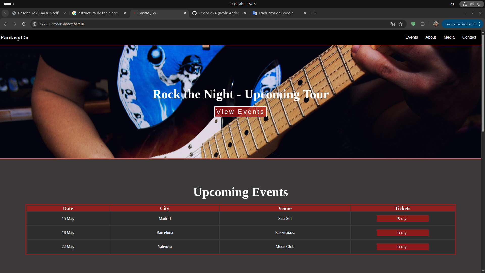
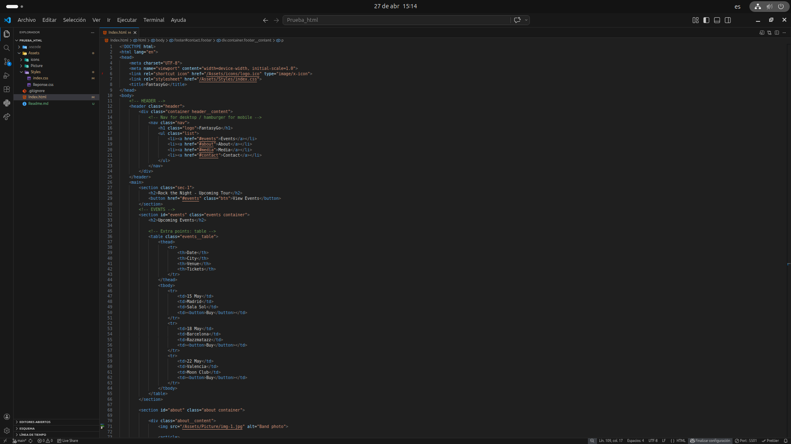

# FantasyGo

## Description

un groupe de rock dont le design suit l'exemple actuel

## Design Reponse

- ** Desktop : ** the interface reponse pour desktop
- ** section: ** section animes interactive pour users
- ** section about: ** efect visual and information detailed

##  folder structure

- ** Assets: 
- ** Styles : ** index.css
- ** picture : ** photo the proyect
- ** HTML5: ** Index.html
- ** gitigonre: ** pour ignore archive the cache
- ** Git: ** tecnology the repository in the nube o web

## comand the git

- ** git clone: ** [text](https://github.com/KevinGo24/Prueba-html.git)
- ** terminal: ** cd Prueba-html
- ** index principal: ** index.html

## Coders

- **  [text](https://github.com/KevinGo24)

## Picture

- **

- ** 